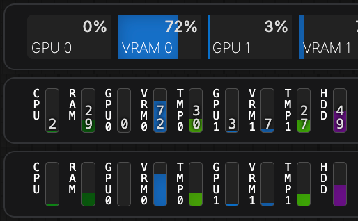

# ComfyUI-Crystools_extend  
Feature extension package for **[ComfyUI-Crystools](https://github.com/crystian/ComfyUI-Crystools)**  

## Preview


## Installation

#### Install the node:
```bash
cd ComfyUI/custom_nodes
git clone https://github.com/lihaoyun6/ComfyUI-Crystools_extend.git
```

## Usage
### Compact Mode:  
Enable compact mode in `Settings` > `Crystools` > `🪛Extend` (you can also hide the percentage)

## Credits
- [ComfyUI](https://github.com/comfyanonymous/ComfyUI) @comfyanonymous
- [ComfyUI-Crystools](https://github.com/crystian/ComfyUI-Crystools) @crystian
